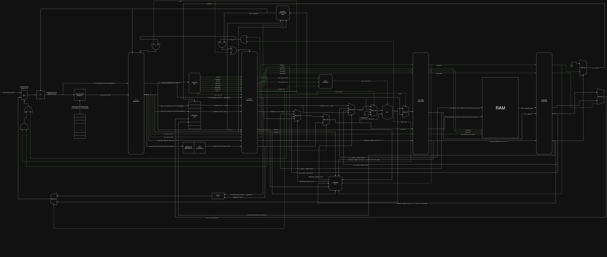

# RV32I 5-Stage Pipelined Processor

[](https://riscv.org/)
[](https://github.com/riscv/riscof)
[]()

A synthesizable, 32-bit RISC-V processor core implementing the RV32I Base Integer Instruction Set. Designed with a classic 5-stage pipeline, complete with a robust hazard detection and data bypass (forwarding) network. 

This repository contains the RTL implementation, simulation testbenches, and architectural compliance testing framework used for [Insert Research Paper Title Here].

---

## 🏗️ Microarchitecture Overview

The core implements a classic RISC 5-stage pipeline: **Instruction Fetch (IF) ➔ Instruction Decode (ID) ➔ Execute (EX) ➔ Memory (MEM) ➔ Writeback (WB)**.



### Key Architectural Features:
* **ISA Support:** Full RV32I Base Integer Instruction Set.
* **Pipeline Registers:** Synchronous isolation between all 5 stages for stable high-frequency scaling.
* **Data Hazard Resolution:** * Integrated **Forwarding Unit** to bypass data from EX/MEM and MEM/WB stages directly to the ALU, resolving Read-After-Write (RAW) hazards without stalling.
  * **Load-Use Hazard Detection:** Hardware stall mechanism to automatically insert pipeline bubbles when a memory read output is immediately required by the next instruction.
* **Control Hazards:** Dynamic pipeline flushing mechanism for taken branches and jumps.
* **Memory Interface:** Separate Instruction and Data Memory interfaces mapped to 64KB arrays with Byte, Halfword, and Word access precision.

---

## 📂 Repository Structure

```text
├── rtl/                    # Core Verilog implementation
│   ├── alu.v               # 32-bit Execution Unit
│   ├── control_unit.v      # Main instruction decoder
│   ├── forwarding_unit.v   # Data bypass network
│   ├── hazard_detection.v  # Pipeline stall logic
│   └── risc_v_top.v        # Top-level core wrapper
├── sim/                    # Simulation and verification
│   └── riscv_tb.v          # Base testbench with memory signature dumping
├── verification/           
│   └── riscof/             # RISC-V Architectural Testing Framework setup
└── docs/                   # Diagrams and microarchitecture specifications
